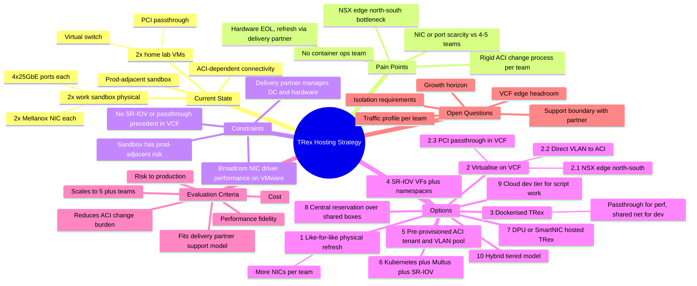

# TRex Hosting Strategy — Problem Statement & Options

## 1. Problem Statement

We run Cisco TRex traffic generators to support performance and functional testing for the network organisation. Today this consists of two home-lab instances (one VM with Mellanox PCI passthrough, one VM on standard VMware virtual interfaces) and two physical servers in a work sandbox environment that sits adjacent to production. Each physical server has two Mellanox NICs (4 x 25GbE ports each), and connectivity is entirely dependent on whatever Cisco ACI construct has been provisioned for it.

The physical servers are due for a hardware refresh, delivered and supported by a third-party delivery partner (we own the data centre; they manage the estate). At the same time, several teams beyond the current owning team want their own TRex capability, each requiring an isolated ACI network path — but provisioning that today means a full ACI change request per team, which doesn't scale to the 4–5 teams who want access.

We also have a new VMware VCF platform available, which could host TRex, but introduces its own constraints: north/south traffic to ACI currently transits a shared NSX edge (BGP), direct virtual-to-ACI adapters and PCI passthrough are both unproven patterns in our VCF estate, and Broadcom's virtual NIC drivers are known to underperform with TRex/DPDK-style workloads.

**The decision we need to make:** what combination of hardware, virtualisation/containerisation, and ACI network design lets multiple teams generate traffic at the performance level they actually need, without a new ACI change request every time a team is onboarded, without jeopardising the adjacent production network, and within what our delivery partner is actually contracted and equipped to support.

---

## 2. Discovery Questions

Before picking a direction, these are the questions worth getting answered and documented — they'll shape which options are even viable.

### Traffic & performance profile
- What is the actual traffic profile each team needs — throughput, pps, packet sizes, stateful vs. stateless, ACI-specific encapsulation (VXLAN, multicast, etc.)?
- Do all teams need sustained near-line-rate generation (25G+), or would most be satisfied with a lower-throughput or virtualised path for functional/script development, reserving full line-rate for a smaller number of validation runs?
- Is dedicated, always-available bandwidth required per team, or is shared/time-sliced access acceptable?

### Isolation & multi-tenancy
- Does team-to-team isolation need to be hardware-level (separate NIC/port), L2 (separate VLAN/EPG), or is software isolation (namespace, virtual function, container) acceptable?
- Are there compliance or security mandates against multiple teams' traffic sharing a physical NIC, or sharing an ACI VRF?
- Could teams share one "TRex sandbox" tenant/VRF with a per-team EPG each, or does policy require a fully separate VRF per team?

### The ACI change process itself
- What specifically makes the current change process "rigorous" — risk to production, approval chain length, lead time, or simply the absence of a pre-approved/automated path?
- Is there (or could there be) a self-service or pre-approved model — Nexus Dashboard Orchestrator, Terraform/Ansible pipelines, a standard change template — that lets teams provision within pre-approved guardrails rather than raising a bespoke change each time?
- Could a single "TRex" tenant/VRF/VLAN pool be provisioned once, so onboarding a new team becomes "assign the next VLAN/EPG from the pool" rather than a new full change?

### VCF / virtualisation constraints
- How much spare capacity exists on the current NSX edge/BGP path to ACI, and will that bottleneck worsen anyway as the wider VCF estate grows?
- Would a dedicated workload domain for TRex (to bypass the edge bottleneck or enable passthrough) be operationally and financially realistic?
- Is the Broadcom driver performance penalty actually quantified, or does it need a proof of concept before ruling virtual NICs in or out?
- Has PCI passthrough been formally assessed and rejected by the VCF platform team, or is it simply "not yet done" — implying it may be viable with the right business case?

### Delivery partner / support boundary
- What's explicitly in scope for the delivery partner (hardware, base OS, hypervisor) versus out of scope (containers, Kubernetes, SR-IOV configuration, the TRex application itself)?
- Would the delivery partner support SR-IOV/virtual-function configuration on the Mellanox NICs, or does that land with an internal team?
- Is there any internal appetite or capacity to run a lightweight container/Kubernetes footprint, even without a dedicated platform team?

### Scale & growth
- How many teams need access today, and how many realistically in the next 2–3 years?
- Do teams need concurrent access, or is scheduled/time-sliced access acceptable, at least during a transition period?
- What future speed/feature growth (100G/400G, new protocols) should the new hardware be sized for?

### Risk & governance
- What's the acceptable blast radius if a misconfiguration on a shared TRex platform reached the adjacent production network?
- Which board or team would need to approve a new self-service ACI model, and what evidence would they need to sign off on it?

### Cost & procurement
- What budget exists for two new physical servers versus a DPU-equipped alternative versus incremental VCF/NSX capacity?
- Do we already hold VCF/NSX licensing that includes SmartNIC/DPU acceleration, reducing the marginal cost of that route?

---

## 3. Options

### Your three options, refined

**Option 1 — Like-for-like physical refresh (+ more NICs)**
New hardware, same model. Adding NICs per team is possible but only pushes the ceiling from 2 teams to maybe 3–4 before running out of PCIe slots/rack space — a scaling patch, not a scaling solution.

**Option 2 — Virtualise on VCF**
- **2.1 NSX edge (north/south via BGP):** simplest to stand up, but the shared edge becomes a hard throughput ceiling for both TRex and the rest of the VCF estate.
- **2.2 Virtual adapter direct to ACI:** works, but breaks the standard VCF network design, threatens site resiliency, and likely needs its own workload domain — a significant ask.
- **2.3 PCI passthrough in VCF:** best performance of the three, but sets a precedent not used anywhere else in the estate, loses vMotion/DRS on those hosts, and doesn't remove the NIC-count ceiling.

**Option 3 — Dockerised TRex**
Gives you a mix of high-performance (Mellanox passthrough) and lightweight shared-network containers for dev work — architecturally attractive, but currently blocked by the lack of a team to operate a container platform, and still needs the two new physical boxes underneath it.

### Additional options to consider

**Option 4 — SR-IOV virtual functions on bare metal (no container platform needed)**
Mellanox ConnectX NICs support SR-IOV: each physical port can be carved into many virtual functions (VFs), each presented to its own Linux network namespace running an independent TRex instance. This gets most of the isolation benefit of Option 3 without needing a Docker/Kubernetes operations team — it's still "just Linux" to the delivery partner. TRex's DPDK poll-mode driver support for VFs varies by ConnectX generation and TRex version, so this needs a short proof of concept against your specific card/firmware before committing.

**Option 5 — Pre-provisioned ACI "TRex" tenant with a standing VLAN pool**
This fixes the process problem directly, independent of hosting choice. Establish one ACI tenant/VRF for TRex with a trunk already extended to the TRex box(es) and a pool of pre-approved VLANs/EPGs. Onboarding a new team becomes "hand them the next VLAN from the pool" — a standard, pre-approved change — rather than a bespoke change request. This can layer on top of Options 1, 4, 6, or 7.

**Option 6 — Kubernetes with Multus CNI + SR-IOV device plugin**
Rather than raw Docker, run TRex pods on Kubernetes with the Multus CNI and an SR-IOV device plugin binding VFs directly to pods. This gives built-in multi-tenancy, RBAC and lifecycle management, and if there's any existing K8s skill elsewhere in the organisation, it's a smaller ask than standing up a bespoke Docker operations capability from scratch. Same underlying performance as Option 4.

**Option 7 — DPU/SmartNIC-hosted TRex (e.g. NVIDIA BlueField)**
Emerging pattern: run TRex on or behind a DPU, which can present multiple isolated virtual functions and terminate ACI VLANs itself, decoupling scale-out from host PCIe slot count. VMware NSX already has DPU-based acceleration support, so this could dovetail with the VCF estate rather than fighting it. Less proven for TRex specifically — treat as a longer-horizon PoC rather than the primary path for the current refresh.

**Option 8 — Central reservation/scheduling over fewer shared boxes**
The cheapest, lowest-risk option: keep a small number of physical boxes, pre-provision a fixed set of VLANs against them, and build a simple booking system so teams reserve time slots. No new ACI config per team, no new hosting technology — just a scheduling process. Doesn't allow true concurrency across all teams, but is a reasonable stopgap while a longer-term option (4, 5, 6 or 7) is piloted.

**Option 9 — Cloud-hosted dev tier for script/functional work only**
Stand up TRex in public cloud purely for script development and functional testing that doesn't need to touch the real ACI fabric, keeping the on-prem sandbox boxes free for genuine performance/validation runs. Not representative of the real 25G ACI fabric for performance numbers, but removes a chunk of demand from the constrained on-prem estate.

**Option 10 — Hybrid tiered model (recommended shape to evaluate first)**
Split the workload by need rather than picking one platform for everything: a virtualised "dev/script" tier on VCF (Option 2.1, accepting the performance ceiling since these workloads don't need line rate) for the majority of day-to-day script and protocol development, plus a bare-metal "performance/validation" tier using SR-IOV VFs (Option 4) on the two new physical boxes for teams that need real throughput numbers. Layer Option 5 underneath both to remove the per-team ACI change burden. Option 8's booking model can smooth the transition while 4/5/6 are piloted.

---

## 4. Option Comparison

| Option | Solves the 4–5 team scaling problem? | Performance fidelity | Removes per-team ACI change? | Ops complexity / fits delivery partner? | Risk to production | Maturity |
|---|---|---|---|---|---|---|
| 1. Like-for-like physical + more NICs | Partial | High | No | Low complexity, good partner fit | Low | Proven |
| 2.1 NSX edge (north/south) | Yes (VM count) | Low (edge bottleneck) | No | Low complexity | Low | Proven |
| 2.2 Virtual adapter direct to ACI | Partial | Medium | No | High complexity, breaks VCF design | Medium–High | Unproven in estate |
| 2.3 PCI passthrough in VCF | Partial | High | No | High complexity, new pattern | Medium | Unproven in estate |
| 3. Dockerised (mixed passthrough/shared) | Yes | High (passthrough) / Medium (shared) | No | High — no owning team today | Medium | Proven pattern elsewhere, not here |
| 4. SR-IOV VFs on bare metal | Yes | High | No (needs Option 5) | Medium, still "just Linux" | Low | Needs PoC |
| 5. Pre-provisioned ACI tenant/VLAN pool | N/A (process fix) | N/A | **Yes** | Low, one-time network change | Low | Standard ACI capability |
| 6. Kubernetes + Multus + SR-IOV | Yes | High | No (needs Option 5) | Medium — leverages existing K8s skill if any | Low | Needs PoC |
| 7. DPU/SmartNIC-hosted TRex | Yes, potentially high | High (unverified for TRex) | Possibly (DPU can terminate VLANs) | Medium–High, new skillset | Medium | Emerging/PoC only |
| 8. Central reservation over shared boxes | Organisational, not technical | High | No | Very low | Low | Proven (process only) |
| 9. Cloud dev-tier for script work | Yes, for dev-only demand | Low (not representative) | N/A (off ACI) | Low–Medium | Low (off prod network) | Proven |
| 10. Hybrid tiered model | Yes | Matched to need | Yes (with Option 5) | Medium | Low | Combination of proven + PoC |

---

## 5. Mind Map (Mermaid — paste into Confluence's Mermaid macro, or render at mermaid.live)

---

## 6. Suggested Next Steps

1. Answer the discovery questions in Section 2 with each stakeholder team — this alone may rule out several options.
2. Run a short SR-IOV proof of concept on the existing Mellanox NICs against the current TRex version (validates Option 4/6/10 before any procurement decision).
3. Ask the ACI team what a "pre-approved standard change" would need to look like for Option 5 — this is likely the single highest-leverage, lowest-cost fix regardless of which hosting option wins.
4. Confirm with the delivery partner what's actually in/out of their support contract before assuming any option is off the table.
